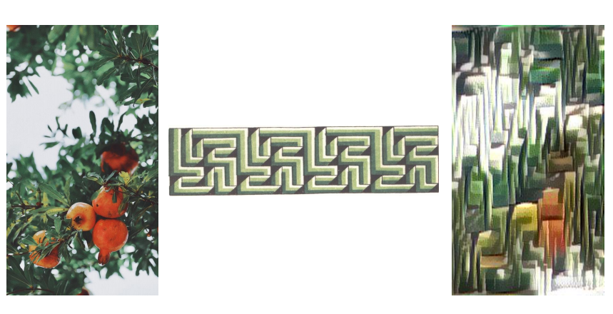

# Neural-Style-Tramsfer-Decorative-Pattern-Synthesis
Research base on [A Neural Algorithm of Artistic Style](https://arxiv.org/abs/1508.06576).

## Use
```
python3 neural_style_transfer.py img/input.jpeg img/style.jpeg result
```

## Result


## Reference
[Neural Algorithm of Artistic Style](https://arxiv.org/abs/1508.06576)

[leongatys/PytorchNeuralStyleTransfer](https://github.com/leongatys/PytorchNeuralStyleTransfer)

[營造法式彩畫研究](https://sanmin.com.tw/product/index/001780172)
